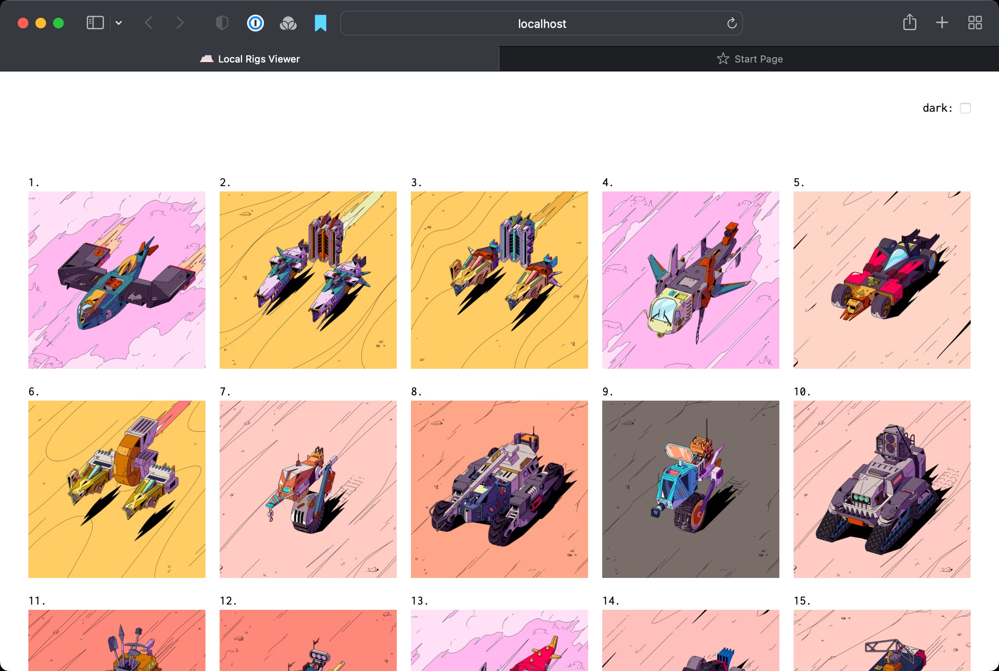

[](./LICENSE)
[](https://goreportcard.com/report/github.com/tablelandnetwork/rigs?style=flat-square)
[](https://github.com/tablelandnetwork/rigs/releases/latest)

[](https://github.com/RichardLitt/standard-readme)

# Rigs

> Tableland Rigs tooling and contract.

# Repo Layout

This repo contains various components of the Rigs tooling and smart contracts. Some important landmarks are:
- `artifacts/` - Various artifacts used as input to the Rigs building process as well as the resulting SQLite data
- `cmd/` - A Go CLI implementation for building and publishing Rigs data and imagery
- `pkg/` - Backing Go packages used by the CLI implementation
- `viewer/` - A Nuxt.js app used by the CLI for viewing built Rigs data locally
- `ethereum/` - The Rigs smart contract

# Artifacts

The `artifacts/` folder contains some build input and output that could be useful for those interested in inspecting or extending Rigs.
- `layers/` - The raw layer folders and images of Rig parts that all Rigs data and imagery was built from
- `local.db` - SQLite database of built Rigs data that was used to publish the official Rigs NFT collection to Tableland using the CLI
- `tableland.db` -  SQLite representation of the official Rigs NFT collection stored on Tableland

# The Rigs CLI

## Build and Install

The Rigs CLI executable can be built by running `make build-rigs` or `go build ./cmd/rigs/`. The resulting executable will end up in the root of the repo working directory. If you want to install it into your `$PATH` using a properly configured Go installation, use `go instsall ./cmd/rigs`.

## Running the CLI

The CLI was used to build and publish the Rigs NFT collection. The CLI is used generally in two different modes, "local" and "publish". The idea is to build Rigs data and imagery locally, perform any inspection and QA on the results, and then publish the resulting data and imagery to Tableland and IPFS.

CLI commands have reasonable defaults for most parameters, but you can customize many settings by using command flags or environment variables. For example, a flag name of `--my-flag` could be set using the environment variable `RIGS_MY_FLAG` (all environment variables must be prefixed with `RIGS_`).

See documentation for any command by calling the command with the `--help` flag.

### Local Mode

To build a Rigs dataset from scratch, the first step is to build the Rigs "inventory". This is the raw data derived from `artifacts/layers`, stored by default in `local.db`, that serves as the building blocks for Rigs data and imagery.

```
> rigs local inventory
```

This will create `local.db` and populate the `parts` and `layers` tables with data.

The next step is to build some actual Rigs data:

```
> rigs local build 200 --no-originals
```

This builds 200 random Rigs, reading from the `parts` and `layers` tables, and storing the resulting data in the `rigs` and `rig_parts` tables of `local.db`. Providing the `--no-orginials` flag means none of the original Rigs (Rigs with all parts from the same original and of matching color) will be built.

You can view some basic statistics about the built Rigs data using the `stats` command.

```
> rigs local stats

...

Fleet Distribution:
        Foils           3       1.5% (2.8%) 
        Hoppers         15      7.5% (8.3%) 
        Edge Riders     18      9.0% (13.9%) 
        Tracers         20      10.0% (11.1%) 
        Airelights      25      12.5% (5.6%) ***
        Sleds           33      16.5% (16.7%) 
        Titans          41      20.5% (22.2%) 
        Tumblers        45      22.5% (19.4%)

...
```

Now that our Rigs data is built, we can render the corresponding images for all the Rigs.

```
> rigs local render
```

The resulting images will be written to a folder called `./renders`. Each subfolder name corresponds to a Rig ID and inside each Rig ID folder are the four images created for the Rig.

```
> ls ./renders/1/
image_full.png        image_full_alpha.png        image_medium.png        image_medium_alpha.png        image_thumb.png        image_thumb_alpha.png
```

You can launch a simple local web app to view the results. 

```
> rigs local view
```



### Publish Mode

Now that we've built our Rigs data and imagery locally, we're ready to publish the imagery to IPFS (via [NFT.storage](https://nft.storage)) and data to Tableland.

> **Note**
> Pushing the Rig images to NFT.storage requires a local [IPFS](https://ipfs.tech) node to be running. The easiest way to do that is using [IPFS Desktop](https://github.com/ipfs/ipfs-desktop). The default settings for the CLI will use the locally running IPFS node's default settings, but you can always customize the connection information using the `--ipfs-api-url` flag.

We'll first push the Rigs images to NFT.storage.

```
> rigs publish images
2022/08/24 20:50:00 Adding folder to IPFS...

...

Images published with CID bafybeiffjkwh6jndds6mvkflhxgkpod3fvc7esaueabn5j6jva5wnw5zhm
```

> **Note**
> Pushing imagery to NFT.storage requires you pass a NFT.storate API key using the `--nft-storage-key` flag. In this example, it has be set using the `RIGS_NFT_STORAGE_KEY` environment variable.

The resulting CID is tracked in `local.db`'s `cids` table and used in an upcoming step to write the Rigs data to Tableland. Before we can do that, we must first create the tables that will hold our Rigs and attributes data on Tableland.

```
> rigs publish schema --rigs --attrs --to-tableland
created table rigs_80001_1217
created table rig_attributes_80001_1218
```

The `--attrs` and `--rigs` flags specify that we want to create the tables to hold the Rigs and their attributes. The names of the resulting tables are tracked in `local.db`'s table called `table_names`. By default, the tables are created on Polygon Mumbai, but you can choose a different chain with the `--chain` flag.

> **Note**
> All write interactions with Tableland (creating and writing to tables) must provide a private key hex string using the `--private-key` flag as well as an EVM backend provider API key using the `--infura` or `--alchemy` flags. In these examples, you can assume the flags were set using the corresponding environment variables `RIGS_PRIVATE_KEY` and `RIGS_INFURA` or `RIGS_ALCHEMY`.

Now we can write our Rigs data to those Tableland tables. The following command transforms our built Rigs data stored in `local.db` into the appropriate SQL statements to populate the Tableland tables, and then executes those SQL statements using Tableland's [Go client](https://pkg.go.dev/github.com/textileio/go-tableland/pkg/client).

```
> rigs publish data --rigs --attrs --to-tableland
processed job 4. rig attrs offset 0
processed job 1. rigs with offset 0
processed job 2. rigs with offset 70
processed job 3. rigs with offset 140
processed job 5. rig attrs offset 70
processed job 6. rig attrs offset 140
done
```

> **Note**
> The above commands to create and write to the Rigs tables include the `--to-tableland` flag. This flag directs the CLI to interact with the actual Tableland network, and if omitted, the CLI will instead execute the same SQL statements against a local SQLite database file called `tableland.db`. This is useful to perform a dry run of publishing the Rigs data and allows inspection of the local SQLite database.

Now that all of our imagery is stored on IPFS and Rigs data written to Tableland, we can integrate it into the Rigs smart contract.

# The Rigs Smart Contract

The Rigs smart contract breaks new ground by utilizing Tableland for NFT metadata and mint allowlists.

[`TablelandRigs.sol`](./ethereum/contracts/TablelandRigs.sol) is the main contract. The following is a high-level overview of the contract features. See [`ITablelandRigs.sol`](./ethereum/contracts/ITablelandRigs.sol) for a detailed overview.

## Overview

Rigs inherits from [ERC721A](https://chiru-labs.github.io/ERC721A). Rigs is an important component of the Tableland protocol. To ensure the contract is able to evolve as Tableland matures, we chose to use [the upgradable version](https://github.com/chiru-labs/ERC721A-Upgradeable) of [ERC721A](https://chiru-labs.github.io/ERC721A). Once Rigs role in Tableland is stable, upgradability will be permanently removed.

## Configuration

Configuration is managed from the [Hardhat config file](./ethereum/hardhat.config.ts) and [`deployments.ts`](./ethereum/deployments.ts). These files include information needed for [contract-level metadata](https://docs.opensea.io/docs/contract-level-metadata), the ERC2981 NFT Royalty Standard, royalty receivers for a payment splitter, max supply, mint price, mint revenue receiver, mint phase, allowlist files, and Tableland tables used for Rig parts, layers, tokens, and attributes that were covered in the Rigs CLI section above.

The [scripts](./ethereum/scripts/) folder contains a number of helpful scripts covered below. The input to these scripts comes from the [Hardhat config file](./ethereum/hardhat.config.ts) and [`deployments.ts`](./ethereum/deployments.ts).

## Deploying

Deployments are handled on a per-network basis:

```
npx hardhat run scripts/deploy.ts --network ethereum
```

Refer to the `deployments.ts` for the list of current deployments.

The [`deploy.ts`](./ethereum/scripts/deploy.ts) script takes care of the following:
1. Loads the owner account from environment variables. See [.env.example](./ethereum/.env.example) for details.
2. Checks to ensure that a deployment doesn't already exist for the target network.
3. Generates the URI template components. See the `getURITemplate` method from [`helpers/uris.ts`](./ethereum/helpers/uris.ts) for more details.
4. Generated the contract metadata URI. See the `getContractURI` method from [`helpers/uris.ts`](./ethereum/helpers/uris.ts) for more details.
5. Deploys an OpenZeppelin [PaymentSplitter.sol](https://github.com/OpenZeppelin/openzeppelin-contracts/blob/master/contracts/finance/PaymentSplitter.sol) with the share holders specified in the [Hardhat config file](./ethereum/hardhat.config.ts). The address of this contract is used with ERC2981 NFT Royalty Standard and in the [contract-level metadata](https://docs.opensea.io/docs/contract-level-metadata) to ensure maximum marketplace compatibility.
6. Creates a Tableland table to store [contract-level metadata](https://docs.opensea.io/docs/contract-level-metadata) and writes values specified in the [Hardhat config file](./ethereum/hardhat.config.ts) and from prior steps.
7. Builds the allowlist and waitlist merkle trees and checks that the allowlist size doesn't exceed the max supply and that the waitlist is the expected size (as specified in [Hardhat config file](./ethereum/hardhat.config.ts)).
8. Creates a Tableland table for the allowlist and waitlist and writes a row for each unique address with columns corresponding to allocations from each list.
9. Deploys an instance of [`TablelandRigs.sol`](./ethereum/contracts/TablelandRigs.sol) with values from prior steps.
10. Lastly, prompts the deployer to save outputs in [`deployments.ts`](./ethereum/deployments.ts) so that can be used in the bundled JS client and with other commands.

You can verify the deployed contracts by running the [verify.ts](./ethereum/scripts/verify.ts) script. You'll need to have Etherscan credentials for the target network (see [.env.example](./ethereum/.env.example)).

Upgrades are handled by the [upgrade.ts](./ethereum/scripts/upgrade.ts) script.

## Mint Phases

Rigs includes a four-phase mint process controlled by the contract owner via `setMintPhase`. The current mint phase is specified in the [Hardhat config file](./ethereum/hardhat.config.ts). The contract owner can run the [`setMintPhase.ts`](./ethereum/scripts/setMintPhase.ts) script, which simply reads the current phase and calls the contract. This makes managing the phases of a mint very easy.

The four mint phases:
  - `CLOSED`: This is the default phase after the contract is deployed. Minting is not allowed.
  - `ALLOWLIST`: During this phase, addresses that are part of the allowlist (as generated during deployment from CSV files), are allowed to mint their allocation.
  - `WAITLIST`: During this phase, addresses that are part of the waitlist (as generated during deployment from CSV files), are allowed to mint their allocation.
  - `PUBLIC`: Anyone can mint during this phase, so long as the number of tokens doesn't exceed the max supply as specified during deployment.

If an address has allocations on the allowist and the waitlist _and_ they minted during the `ALLOWLIST` phase, they will not be allowed to mint durnig the `WAITLIST` phase.

During contract deployment, a merkle tree is created for both the allowlist and the waitlist by reading any number of CSV files specified in the [Hardhat config file](./ethereum/hardhat.config.ts). The format of these CSV files must be `address,free_allowance,paid_allowance`. The `free_allowance` column indicates their allocation of free mints, while the `paid_allowance` indicated their allocation of normal (paid) mints. The roots of these merkle trees are stored in the contract and used to verify client-generated proofs that must be supplied with calls to `mint` (unless the mint phase is `PUBLIC`). While not needed on their own, the scripts [allowist.ts](./ethereum/scripts/allowlist.ts) and [proof.ts](./ethereum/scripts/proof.ts) can be used to generate allowlist merkle trees and generate proofs. This can be helpful if you ever need to manually generate a merkle proof for minting.

See [the tests](./ethereum/test/TablelandRigs.ts) to get a deeper view into the allowlist handling logic.

## Tableland NFT Metadata

NFT metadata can be queried from Tableland by calling Tableland's `/query` endpoint with the appropriate SQL query string. For Rigs, this query is defined in [ethereum/helpers/uris.ts](ethereum/helpers/uris.ts). This query string is used by the contract function `tokenURI(uint256 tokenId)` to return the Tableland `/query` URL for the specified token ID. An example of this URL for Rig 2856 can be seen [here](https://testnet.tableland.network/query?extract=true&unwrap=true&s=select%20json_object(%27name%27%2C%27Rig%20%23%27%7C%7Cid%2C%27external_url%27%2C%27https%3A%2F%2Ftableland.xyz%2Frigs%2F%27%7C%7Cid%2C%27image%27%2Cimage%2C%27image_alpha%27%2Cimage_alpha%2C%27thumb%27%2Cthumb%2C%27thumb_alpha%27%2Cthumb_alpha%2C%27attributes%27%2Cjson_group_array(json_object(%27display_type%27%2Cdisplay_type%2C%27trait_type%27%2Ctrait_type%2C%27value%27%2Cvalue)))%20from%20rigs_5_28%20join%20rig_attributes_5_27%20on%20rigs_5_28.id%3Drig_attributes_5_27.rig_id%20where%20id%3D2856%20group%20by%20id%3B).

That metadata URL is unique in that it requires the token ID be inserted into the middle of the URL string, something not typically supported by ERC721 implementations. Additionally, during the Rigs minting process, we chose to make visible the minted Rigs images and top-level metadata, while hiding the more detailed attribute metadata until after the mint period ended. This required being able to change the URI returned from `tokenURI(uint256 tokenId)` from the SQL query that hides attribute data to the one that returns it. 

Both of these challenges were solved by a custom `onlyOwner` contract function we added called `setURITemplate(string[] memory uriTemplate)`. This allows the caller to provide the two parts of the URL string (the "template") to be wrapped around the token ID, the resulting URL string being returned from `tokenURI(uint256 tokenId)`. Since this function can be called repeatedly, we were able to update the URL template from the version that hides metadata attributes to the one that returns them. As mentioned above, there's a script called [setURITemplate.ts](./ethereum/scripts/setURITemplate.ts) that builds the URI template query from Tableland tables specified in the [Hardhat config file](./ethereum/hardhat.config.ts).

## Development

### Building the client

You can build the contracts and Typescript client locally:

```shell
npm install
npm run build
```

### Install the client

The Rigs client is used in the Garage.

```
npm install @tableland/rigs
```

### Testing

Run the test suite:

```shell
npm test
```

Test with gas reporting:

```shell
REPORT_GAS=true npx hardhat test
```

### Extacting the ABI and Bytecode

You can you grab the assets you need by compiling and then using some `jq` magic:

#### ABI

```shell
cat artifacts/contracts/TablelandRigs.sol/TablelandRigs.json | jq '.abi' > abi.json
```

#### Bytecode

```shell
cat artifacts/contracts/TablelandRigs.sol/TablelandRigs.json | jq -r '.bytecode' > bytecode.bin
```

#### Generate the Go client

You can use the above `abi.json` to build the Go client:

```shell
mkdir gobuild
abigen --abi ./abi.json --bin ./bytecode.bin --pkg contracts --out gobuild/TablelandRigs.go
```

# License

[The Unlicense](LICENSE)
